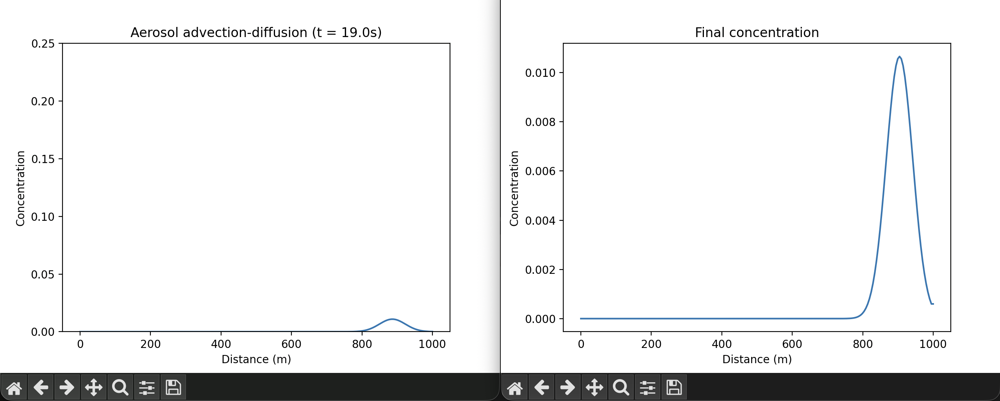

# Aerosol Advection-Diffusion Model (Python)

A simple 1D aerosol transport model simulating how particles move with wind (advection) and spread out over time (diffusion).

This project demonstrates:

- Numerical modelling on a spatial grid
- Finite difference methods
- Stability considerations
- Mass conservation checks

---

# Demo



---

## Physics Model

We simulate the 1D advection-diffusion equation:

∂C/∂t = -u ∂C/∂x + D ∂²C/∂x²

Where:
- C = concentration
- u = wind speed
- D = diffusion coefficient

---

## Numerical Method

- Spatial discretisation using finite differences
- First-order upwind scheme for advection
- Central difference for diffusion
- Explicit time stepping

---

## Installation

Clone the repository:

```bash
git clone https://github.com/hcmaxwell/aerosol-model.git
cd aerosol-model
pip install -r requirements.txt
python main.py
